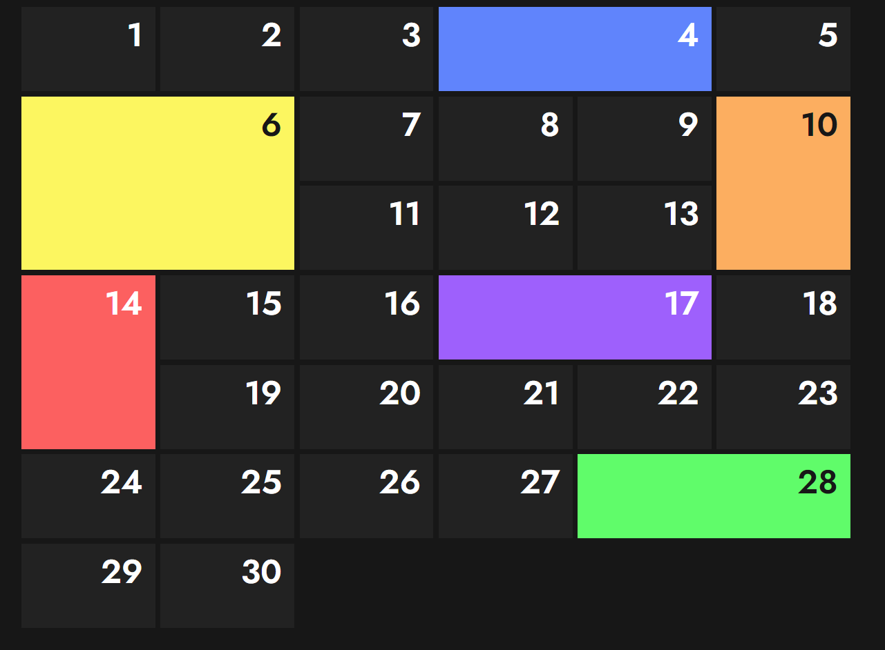
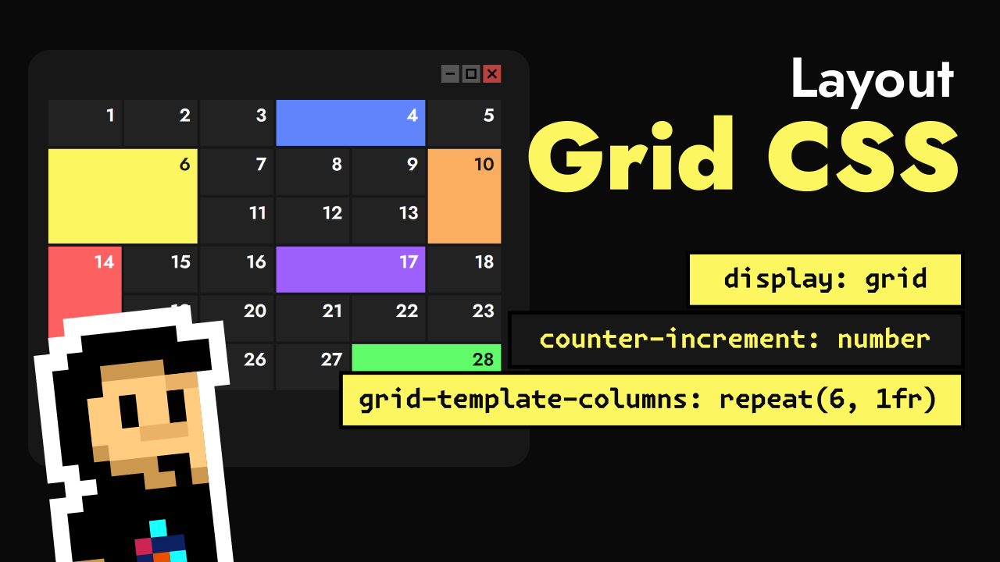

# Grid Calendar

- 📘 Grid: https://lenguajecss.com/css/maquetacion-y-colocacion/grid-css/
- 📘 Celdas irregulares: https://lenguajecss.com/css/maquetacion-y-colocacion/grid-css-celdas-irregulares/
- 📘 Contadores CSS: https://lenguajecss.com/css/representacion-datos/contadores-css/

**Previsualización**:

Video de Youtube:

- Twitch: https://twitch.tv/ManzDev
- Twitter: https://twitter.com/Manz
- Redes sociales: https://links.manz.dev/
- Página oficial: https://manz.dev/
